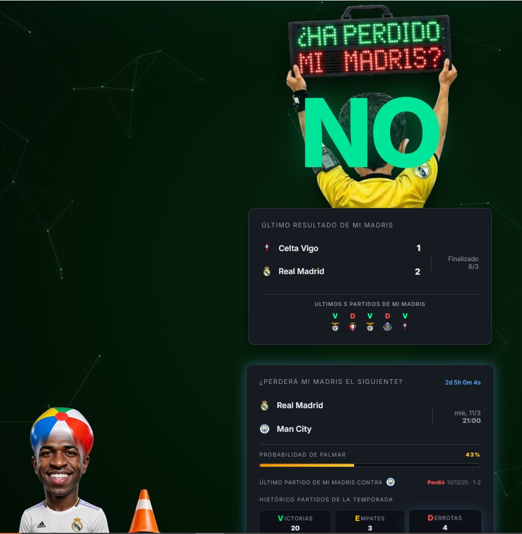

# 🏟️ ¿Ha perdido mi Madris? (El Humómetro™)

¿Estás cansado de que te vendan la moto en el Chiringuito? ¿Vives con el miedo constante a que el equipo se pegue un batacazo contra un recién ascendido?
**Bienvenido a la herramienta definitiva de salud mental para el madridismo.**
Esta web no trata de fútbol, es de **gestión del dolor**.

## 🧐 ¿Qué hace esta maravilla?

Nuestra tecnología de punta (basada en el pánico y APIs gratuitas) responde a la única pregunta que importa cada fin de semana:

* **El Veredicto:** Un rotundo **SÍ**, **NO** o **CASI** (el peligroso empate) que cambia el color de toda la web según el nivel de drama.
* **Factor de Humo™:** Un cálculo científico que te dice cuántas veces ha pinchado el Madrid en los últimos 5 partidos. Spoiler: suelen ser demasiadas.
* **Probabilidad de Batacazo:** Calculamos cuánto vamos a sufrir contra el próximo rival. Si la barra parpadea en rojo, mejor apaga la tele.
* **Flash de Pánico:** Si hay un gol en directo, la pantalla lanza un flash blanco para que te dé un micro-infarto antes de saber si es a favor o en contra.

## 🛠️ Stack Tecnológico

* **HTML5/CSS3:** Para que el sufrimiento se vea bonito y minimalista.
* **JavaScript (Vanilla):** Sin frameworks raros, como los pases de Modric, directo y al pie.
* **API de ESPN:** De donde robamos... perdón, *tomamos prestados* los datos en tiempo real.
* **Muchos lloros:** El motor principal que alimenta esta aplicación.

## 📸 Capturas de pantalla (o pruebas del delito)

## 🏃‍♂️ Cómo usarlo

1.  Abre la web.
2.  Mira el título gigante.
3.  Llora o celebra (normalmente lo primero).
4.  Si ves a **Vini** o a **Arbeloa** asomando por las esquinas, no es un virus, es que te están vigilando.

## 🤝 Contribuciones

Si sabes cómo reducir la probabilidad de que nos metan gol en el minuto 90, abre un *Pull Request*. Si no, simplemente deja una estrella para que el algoritmo nos trate mejor que el VAR.

---
*Hecho con ❤️ y mucha paciencia por un madridista al borde del colapso.*
